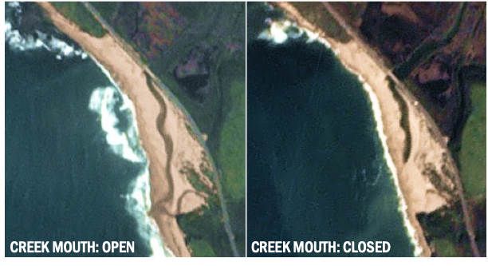

# berm_alert

## Overview: 
A CNN classifier that can indicate if a coastal stream is bermed (i.e. a lagoon has formed) or is open to the sea fom Planet remote sensing data

## Motivation:
Resource managers are often concerned about the status of the mouths of coastal streams due to impacts to:

- Fish passage: berms control when anadromous fish such as salmon and steelhead can migrate to and from the ocean
- Water quality: Contamination can build up in bermed lagoons. When the berm is breached, that contamination is released to the nearshore environment, impacting water quality for beachgoers and nearshore ecosystems
- Surf quality/Sediment transport: Streams transfer sediment from higher in a watershed out to the coast. This has impacts on beach morphology (i.e. is there sand on the beach?) and nearshore sandbars, which impact wave quality for surfers.

However, many coastal streams are located in remote regions where manually determining the berm status at high temporal resolution is unrealistic.

## Methods:
The following steps may be followed to develop a Berm Alert system for your creek:

### 1. Harvest and classifuy training images of the creek mouth
- Create a .geojson file to define the boundaries of the image
- Run `get_images_Planet.py` to harvest Planet remote sensing images for a given beach and set of dates. Note: approximately 150 images of a beach in each of the berm states (i.e. open and closed) are needed to sufficiently train the model
- Run `convert_tif.py` to convert Planet .tif images to .png (the format required by TF models)
- Manually classify images into `open` and `closed` subdirectories

### 2. Train classifier
- Use the `berm_alert.ipynb` Colab notebook to create training and validation datasets, create and train the classifier model, and test predictions.

Note: you may wish to continue training the example model provided in this repo with new images

Image Credit: Planet
RTS - January 2023
